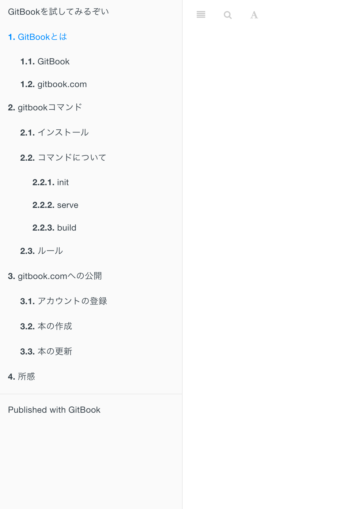

# `GitBook`におけるルールについて

`GitBook`では、`SUMMARY.md`というファイルが必要になります。

この`SUMMARY.md`には少し特有の記述ルールがあるのでそれについて触れていきます。

## そもそも`SUMMARY.md`とは

ざっくり言うと`目次を良い感じにしてくれるmarkdown`です。(ざっくり)



例えば`GitBook`で変換されたhtmlだと、左側にこのように目次がつきますが、この部分ですね。

これをよしなに作成してくれるのが`SUMMARY.md`になっています。

よしなにしてもらうためにちょっとしたルールが必要、というわけです。上記の目次を生成するための`SUMMARY.md`を見てましょう。

```markdown
* [GitBookを試してみるぞい](README.md)

* [GitBookとは](/introduce/README.md)
  * [GitBook](/introduce/gitbook.md)
  * [gitbook.com](/introduce/gitbook.com.md)
* [gitbookコマンド](/gitbook-cli/README.md)
  * [インストール](/gitbook-cli/install.md)
  * [コマンドについて](/gitbook-cli/commands.md)
    * [init](/gitbook-cli/commands/init.md)
    * [serve](/gitbook-cli/commands/serve.md)
    * [build](/gitbook-cli/commands/build.md)
  * [ルール](/gitbook-cli/rule.md)
* [gitbook.comへの公開](gitbook.com/README.md)
  * [アカウントの登録](/gitbook.com/signup.md)
  * [本の作成](/gitbook.com/create.md)
  * [本の更新](/gitbook.com/update.md)
* [所感](/impression/README.md)
```

これと画像を見比べればなんとなくはわかると思いますが、簡単に説明します。

* `*`を用いて記述していくとchapter番号がつく
* `*`をネストするとそれに合わせてネストしたchapter番号がつく
* 基本はリンクを貼る(リンクを貼らないとクリック不可な目次になります)
* 目次内で重複したリンク先は許可されない
* `README.md`に対してリンクを貼ると、最上段に表示されているchapter番号なしの表示になる

おそらくこれくらいかなと思います。

この辺りの仕様は割と手探りで見つけたので、どこかまとまっていたら教えてもらえると助かりますmm