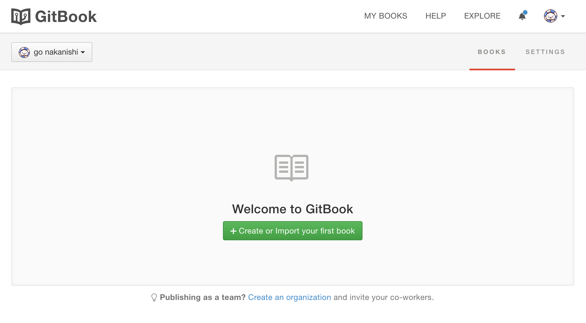
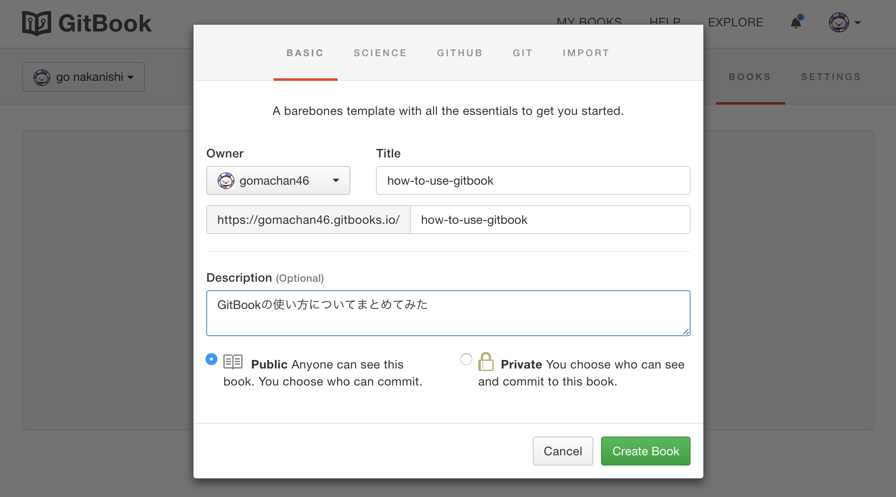

# 本の作成

ログイン後、以下のような画面が出ると思うので、この緑色のボタンから本の作成が可能です。

`GitHub`で言うところのリポジトリの作成にあたります。

今回はコマンドラインベースでの扱いをベースとしているので触れないですが`GitHub`のリポジトリをインポートしてそのまま本にすることもできて便利です。

以下、画像のように本の作成を完了させてください。

ここまでできたら、色々とGUIの操作勧誘が来ますが、今回はコマンドラインベースなので全て無視して画面上の操作は終了ですw

後で必要なので、アカウント名と、本のタイトル(リポジトリ名みたいなやつ)を控えておいてください。

今回の例で言うと

* アカウント名
  * gomachan46
* 本のタイトル
  * how-to-use-gitbook

のような情報になります。