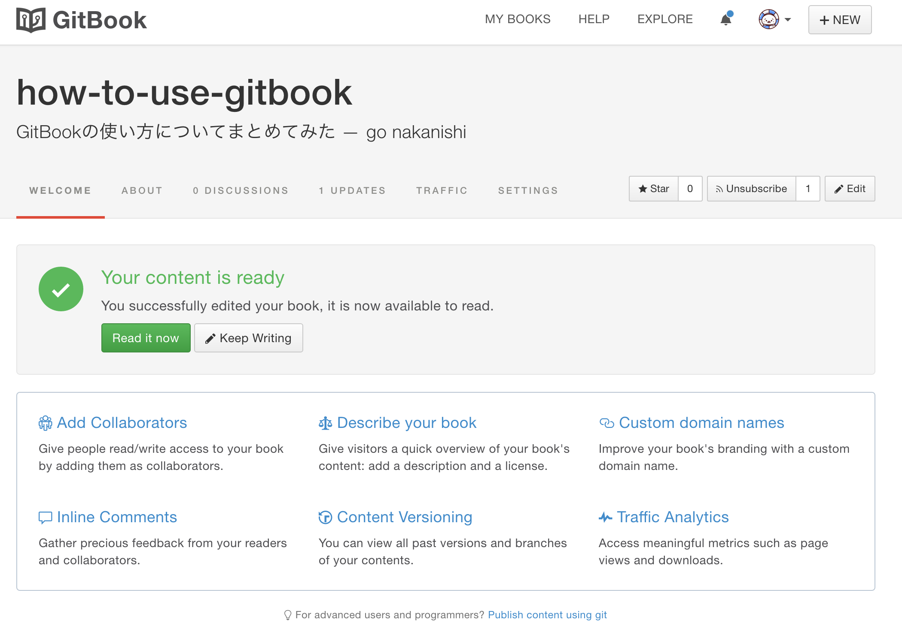
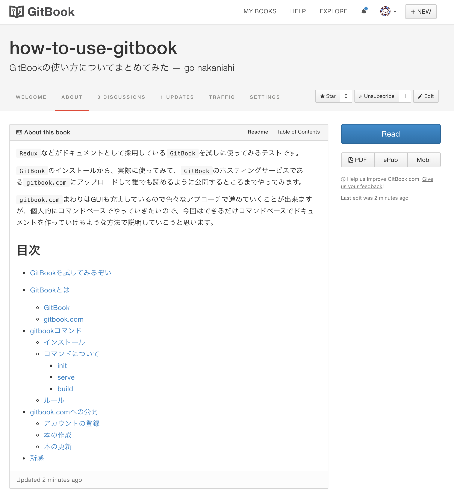
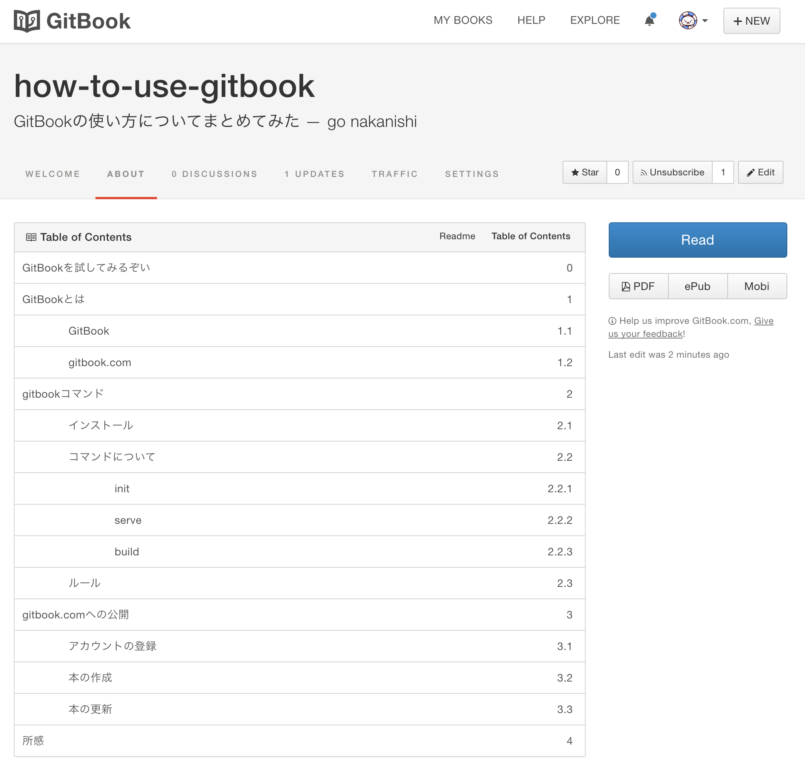
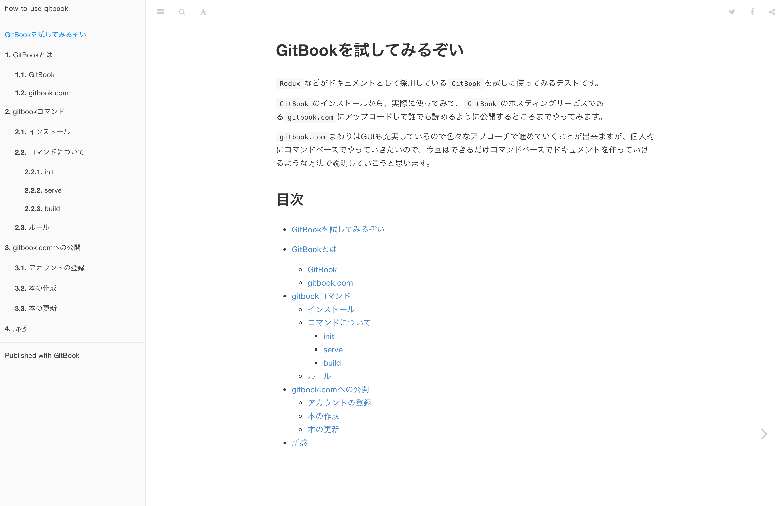

# 本の更新

最後の作業です！

書いたmarkdownを`gitbook.com`へデプロイしていきます。

このデプロイが完了すれば、めでたく本の更新が出来ます。

`gitbook.com`はHerokuのように`git push`で簡単にデプロイが出来るようになっているので、それに従って行っていきます。

## リモートリポジトリの登録

markdownで書き溜めた文書のあるリポジトリに、リモートリポジトリとして`gitbook.com`を追加していきます。

ここで先ほど控えておいてもらった`アカウント名`と`本のタイトル`が必要になります。

```
git remote add gitbook https://git.gitbook.com/<アカウント名>/<本のタイトル>.git
```

今回の僕の例で言うと、

```
git remote add gitbook https://git.gitbook.com/gomachan46/how-to-use-gitbook.git
```

このようにリモートリポジトリが登録できたらもうあとは簡単で、

```
git push gitbook master
```

みたいにすればデプロイは完了です！

この時、`gitbook.com`へのログイン時に求められる`username`と`password`の入力を求められるので、指示に従って入力してください。

ここで先ほど表示されていたダッシュボードの画面を再び見てみると...？






良い感じに無事に更新できました！これで作業は全て完了です！

公開もちゃんとされています。今回のこのまとめた文書も以下のURLから確認可能です。

https://gomachan46.gitbooks.io/how-to-use-gitbook/content/

https://gomachan46.gitbooks.io/how-to-use-gitbook

# 参考

https://help.gitbook.com/build/push.html
